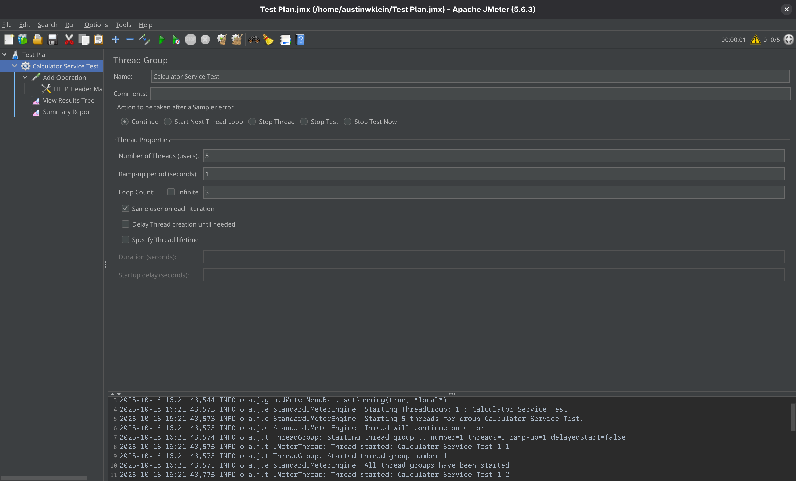

# Testing with JMeter 

---
### Requirements (Blackboard)
>This is discussed in-class on September 30th. Presentation 10. Slide title, "Apache JMeter Testing… "
>
>This assignment can be run as a continuation of the "Axis 2 in a Tomcat container" assignment.
> 
>In "Axis 2 in a Tomcat container" you configured Axis 2 Web Services Engine in an Apache Tomcat Servlet Engine. Then, you deployed some web services in them (If you have not succeeded in deploying your own web services, you could find existing web services from [Axis 2 source code](https://axis.apache.org/axis2/java/core/docs/userguide-samples.html#services)
>
>Now, we are going to test it with Apache JMeter, rather than using our own Axis 2 client or the browser.
>
>Follow through [JMeter test plan documentation](https://jmeter.apache.org/usermanual/get-started.html), test your web service deployed in Axis 2, and run your JMeter tests.
>
>You will encounter the message "GUI mode should only be used for creating the test script, CLI mode (NON GUI) must be used for load testing." This is a valid point (to conserve processing power, and to ensure smooth testing and to scale the testing with other supportive tools such as Apache Bench). But in this assignment, please use the GUI mode for Apache JMeter and screenshot the JMeter results.
>
>In the submission, upload the below:
>
>1) screenshots that you import from JMeter (or screenshots showing JMeter running)
>
>2) the JMX file of the JMeter test definition.
>
>3) the WSDL file that you used for the service implementation.
>
>Your screenshot should clearly show that you were mimicking several "clients" with your JMeter (i.e., not just one task, definite the test plan accordingly).

---

## **System Configuration**

OS  
: Fedora 42 Workstation  

Java Dev Kit  
: OpenJDK **21.0.8** 2025-07-15  

JMeter Version  
: 5.6.3  

---

## **Assignment Requirements**

#### JMeter Screenshots

I ran into an issue immediately where the jmeter GUI was far too small to be usable. With some research I found this is a common issue for high density displays and there was a modification I had to make to the `./bin/jmeter` file. This file said to instead make those changes in a modular file at `./bin/setenv.sh` to keep it separate from the base config.

```shell setenv.sh
JVM_ARGS="-Dsun.java2d.uiScale=2.5"
```


*JMeter First Startup (With display fix implemented)*


*Test Plan*


*Testing with calculator API from www.dneonline.com/calculator*  
As can be seen above, the number of users are set to 5 with the number of loops as 3. This means there are 15 http requests being made across 5 connections.


*HTTP Request Body*  
In the request body, we are setting two integers to send to be summed by the /calculator API, 3 and 4. For the /calculator API to know what to do with these numbers, we will move on to the HTTP Request Headers (next screenshot).


*HTTP Request Headers*


*Results Tree Output*
This is where we can see that the http return code of the 15 requests were successful. As can be seen in the screenshot, I highlighted the portion of interest that shows the API actually did something. 


*Summary Report*
This is an output of the summary report tab I added to the test. The stats of the test can be viewed here and there are a few options to configure the output even further.

---

#### JMX File of JMeter Test Definition

```xml (Test-Plan.jmx)
<?xml version="1.0" encoding="UTF-8"?>
<jmeterTestPlan version="1.2" properties="5.0" jmeter="5.6.3">
  <hashTree>
    <TestPlan guiclass="TestPlanGui" testclass="TestPlan" testname="Test Plan">
      <elementProp name="TestPlan.user_defined_variables" elementType="Arguments" guiclass="ArgumentsPanel" testclass="Arguments" testname="User Defined Variables">
        <collectionProp name="Arguments.arguments"/>
      </elementProp>
    </TestPlan>
    <hashTree>
      <ThreadGroup guiclass="ThreadGroupGui" testclass="ThreadGroup" testname="Calculator Service Test">
        <intProp name="ThreadGroup.num_threads">5</intProp>
        <intProp name="ThreadGroup.ramp_time">1</intProp>
        <boolProp name="ThreadGroup.same_user_on_next_iteration">true</boolProp>
        <stringProp name="ThreadGroup.on_sample_error">continue</stringProp>
        <elementProp name="ThreadGroup.main_controller" elementType="LoopController" guiclass="LoopControlPanel" testclass="LoopController" testname="Loop Controller">
          <stringProp name="LoopController.loops">3</stringProp>
          <boolProp name="LoopController.continue_forever">false</boolProp>
        </elementProp>
      </ThreadGroup>
      <hashTree>
        <HTTPSamplerProxy guiclass="HttpTestSampleGui" testclass="HTTPSamplerProxy" testname="Add Operation">
          <stringProp name="HTTPSampler.domain">www.dneonline.com</stringProp>
          <stringProp name="HTTPSampler.protocol">http</stringProp>
          <stringProp name="HTTPSampler.path">/calculator.asmx</stringProp>
          <boolProp name="HTTPSampler.follow_redirects">true</boolProp>
          <stringProp name="HTTPSampler.method">POST</stringProp>
          <boolProp name="HTTPSampler.use_keepalive">true</boolProp>
          <boolProp name="HTTPSampler.postBodyRaw">true</boolProp>
          <elementProp name="HTTPsampler.Arguments" elementType="Arguments">
            <collectionProp name="Arguments.arguments">
              <elementProp name="" elementType="HTTPArgument">
                <boolProp name="HTTPArgument.always_encode">false</boolProp>
                <stringProp name="Argument.value">&lt;?xml version=&quot;1.0&quot; encoding=&quot;utf-8&quot;?&gt;&#xd;
&lt;soap:Envelope xmlns:soap=&quot;http://schemas.xmlsoap.org/soap/envelope/&quot;&#xd;
               xmlns:xsi=&quot;http://www.w3.org/2001/XMLSchema-instance&quot;&#xd;
               xmlns:xsd=&quot;http://www.w3.org/2001/XMLSchema&quot;&gt;&#xd;
  &lt;soap:Body&gt;&#xd;
    &lt;Add xmlns=&quot;http://tempuri.org/&quot;&gt;&#xd;
      &lt;intA&gt;3&lt;/intA&gt;&#xd;
      &lt;intB&gt;4&lt;/intB&gt;&#xd;
    &lt;/Add&gt;&#xd;
  &lt;/soap:Body&gt;&#xd;
&lt;/soap:Envelope&gt;&#xd;
</stringProp>
                <stringProp name="Argument.metadata">=</stringProp>
              </elementProp>
            </collectionProp>
          </elementProp>
        </HTTPSamplerProxy>
        <hashTree>
          <HeaderManager guiclass="HeaderPanel" testclass="HeaderManager" testname="HTTP Header Manager">
            <collectionProp name="HeaderManager.headers">
              <elementProp name="" elementType="Header">
                <stringProp name="Header.name">Content-Type</stringProp>
                <stringProp name="Header.value">text/xml; charset=utf-8</stringProp>
              </elementProp>
              <elementProp name="" elementType="Header">
                <stringProp name="Header.name">SOAPAction</stringProp>
                <stringProp name="Header.value">&quot;http://tempuri.org/Add&quot;</stringProp>
              </elementProp>
            </collectionProp>
          </HeaderManager>
          <hashTree/>
        </hashTree>
        <ResultCollector guiclass="ViewResultsFullVisualizer" testclass="ResultCollector" testname="View Results Tree">
          <boolProp name="ResultCollector.error_logging">false</boolProp>
          <objProp>
            <name>saveConfig</name>
            <value class="SampleSaveConfiguration">
              <time>true</time>
              <latency>true</latency>
              <timestamp>true</timestamp>
              <success>true</success>
              <label>true</label>
              <code>true</code>
              <message>true</message>
              <threadName>true</threadName>
              <dataType>true</dataType>
              <encoding>false</encoding>
              <assertions>true</assertions>
              <subresults>true</subresults>
              <responseData>false</responseData>
              <samplerData>false</samplerData>
              <xml>false</xml>
              <fieldNames>true</fieldNames>
              <responseHeaders>false</responseHeaders>
              <requestHeaders>false</requestHeaders>
              <responseDataOnError>false</responseDataOnError>
              <saveAssertionResultsFailureMessage>true</saveAssertionResultsFailureMessage>
              <assertionsResultsToSave>0</assertionsResultsToSave>
              <bytes>true</bytes>
              <sentBytes>true</sentBytes>
              <url>true</url>
              <threadCounts>true</threadCounts>
              <idleTime>true</idleTime>
              <connectTime>true</connectTime>
            </value>
          </objProp>
          <stringProp name="filename"></stringProp>
        </ResultCollector>
        <hashTree/>
        <ResultCollector guiclass="SummaryReport" testclass="ResultCollector" testname="Summary Report">
          <boolProp name="ResultCollector.error_logging">false</boolProp>
          <objProp>
            <name>saveConfig</name>
            <value class="SampleSaveConfiguration">
              <time>true</time>
              <latency>true</latency>
              <timestamp>true</timestamp>
              <success>true</success>
              <label>true</label>
              <code>true</code>
              <message>true</message>
              <threadName>true</threadName>
              <dataType>true</dataType>
              <encoding>false</encoding>
              <assertions>true</assertions>
              <subresults>true</subresults>
              <responseData>false</responseData>
              <samplerData>false</samplerData>
              <xml>false</xml>
              <fieldNames>true</fieldNames>
              <responseHeaders>false</responseHeaders>
              <requestHeaders>false</requestHeaders>
              <responseDataOnError>false</responseDataOnError>
              <saveAssertionResultsFailureMessage>true</saveAssertionResultsFailureMessage>
              <assertionsResultsToSave>0</assertionsResultsToSave>
              <bytes>true</bytes>
              <sentBytes>true</sentBytes>
              <url>true</url>
              <threadCounts>true</threadCounts>
              <idleTime>true</idleTime>
              <connectTime>true</connectTime>
            </value>
          </objProp>
          <stringProp name="filename"></stringProp>
        </ResultCollector>
        <hashTree/>
      </hashTree>
    </hashTree>
  </hashTree>
</jmeterTestPlan>
```

---

#### WSDL File for Service Implementation

```xml (calculator.wsdl)
<?xml version="1.0" encoding="utf-8"?>
<wsdl:definitions xmlns:soap="http://schemas.xmlsoap.org/wsdl/soap/" xmlns:tm="http://microsoft.com/wsdl/mime/textMatching/" xmlns:soapenc="http://schemas.xmlsoap.org/soap/encoding/" xmlns:mime="http://schemas.xmlsoap.org/wsdl/mime/" xmlns:tns="http://tempuri.org/" xmlns:s="http://www.w3.org/2001/XMLSchema" xmlns:soap12="http://schemas.xmlsoap.org/wsdl/soap12/" xmlns:http="http://schemas.xmlsoap.org/wsdl/http/" targetNamespace="http://tempuri.org/" xmlns:wsdl="http://schemas.xmlsoap.org/wsdl/">
  <wsdl:types>
    <s:schema elementFormDefault="qualified" targetNamespace="http://tempuri.org/">
      <s:element name="Add">
        <s:complexType>
          <s:sequence>
            <s:element minOccurs="1" maxOccurs="1" name="intA" type="s:int" />
            <s:element minOccurs="1" maxOccurs="1" name="intB" type="s:int" />
          </s:sequence>
        </s:complexType>
      </s:element>
      <s:element name="AddResponse">
        <s:complexType>
          <s:sequence>
            <s:element minOccurs="1" maxOccurs="1" name="AddResult" type="s:int" />
          </s:sequence>
        </s:complexType>
      </s:element>
      <s:element name="Subtract">
        <s:complexType>
          <s:sequence>
            <s:element minOccurs="1" maxOccurs="1" name="intA" type="s:int" />
            <s:element minOccurs="1" maxOccurs="1" name="intB" type="s:int" />
          </s:sequence>
        </s:complexType>
      </s:element>
      <s:element name="SubtractResponse">
        <s:complexType>
          <s:sequence>
            <s:element minOccurs="1" maxOccurs="1" name="SubtractResult" type="s:int" />
          </s:sequence>
        </s:complexType>
      </s:element>
      <s:element name="Multiply">
        <s:complexType>
          <s:sequence>
            <s:element minOccurs="1" maxOccurs="1" name="intA" type="s:int" />
            <s:element minOccurs="1" maxOccurs="1" name="intB" type="s:int" />
          </s:sequence>
        </s:complexType>
      </s:element>
      <s:element name="MultiplyResponse">
        <s:complexType>
          <s:sequence>
            <s:element minOccurs="1" maxOccurs="1" name="MultiplyResult" type="s:int" />
          </s:sequence>
        </s:complexType>
      </s:element>
      <s:element name="Divide">
        <s:complexType>
          <s:sequence>
            <s:element minOccurs="1" maxOccurs="1" name="intA" type="s:int" />
            <s:element minOccurs="1" maxOccurs="1" name="intB" type="s:int" />
          </s:sequence>
        </s:complexType>
      </s:element>
      <s:element name="DivideResponse">
        <s:complexType>
          <s:sequence>
            <s:element minOccurs="1" maxOccurs="1" name="DivideResult" type="s:int" />
          </s:sequence>
        </s:complexType>
      </s:element>
    </s:schema>
  </wsdl:types>
  <wsdl:message name="AddSoapIn">
    <wsdl:part name="parameters" element="tns:Add" />
  </wsdl:message>
  <wsdl:message name="AddSoapOut">
    <wsdl:part name="parameters" element="tns:AddResponse" />
  </wsdl:message>
  <wsdl:message name="SubtractSoapIn">
    <wsdl:part name="parameters" element="tns:Subtract" />
  </wsdl:message>
  <wsdl:message name="SubtractSoapOut">
    <wsdl:part name="parameters" element="tns:SubtractResponse" />
  </wsdl:message>
  <wsdl:message name="MultiplySoapIn">
    <wsdl:part name="parameters" element="tns:Multiply" />
  </wsdl:message>
  <wsdl:message name="MultiplySoapOut">
    <wsdl:part name="parameters" element="tns:MultiplyResponse" />
  </wsdl:message>
  <wsdl:message name="DivideSoapIn">
    <wsdl:part name="parameters" element="tns:Divide" />
  </wsdl:message>
  <wsdl:message name="DivideSoapOut">
    <wsdl:part name="parameters" element="tns:DivideResponse" />
  </wsdl:message>
  <wsdl:portType name="CalculatorSoap">
    <wsdl:operation name="Add">
      <wsdl:documentation xmlns:wsdl="http://schemas.xmlsoap.org/wsdl/">Adds two integers. This is a test WebService. ©DNE Online</wsdl:documentation>
      <wsdl:input message="tns:AddSoapIn" />
      <wsdl:output message="tns:AddSoapOut" />
    </wsdl:operation>
    <wsdl:operation name="Subtract">
      <wsdl:input message="tns:SubtractSoapIn" />
      <wsdl:output message="tns:SubtractSoapOut" />
    </wsdl:operation>
    <wsdl:operation name="Multiply">
      <wsdl:input message="tns:MultiplySoapIn" />
      <wsdl:output message="tns:MultiplySoapOut" />
    </wsdl:operation>
    <wsdl:operation name="Divide">
      <wsdl:input message="tns:DivideSoapIn" />
      <wsdl:output message="tns:DivideSoapOut" />
    </wsdl:operation>
  </wsdl:portType>
  <wsdl:binding name="CalculatorSoap" type="tns:CalculatorSoap">
    <soap:binding transport="http://schemas.xmlsoap.org/soap/http" />
    <wsdl:operation name="Add">
      <soap:operation soapAction="http://tempuri.org/Add" style="document" />
      <wsdl:input>
        <soap:body use="literal" />
      </wsdl:input>
      <wsdl:output>
        <soap:body use="literal" />
      </wsdl:output>
    </wsdl:operation>
    <wsdl:operation name="Subtract">
      <soap:operation soapAction="http://tempuri.org/Subtract" style="document" />
      <wsdl:input>
        <soap:body use="literal" />
      </wsdl:input>
      <wsdl:output>
        <soap:body use="literal" />
      </wsdl:output>
    </wsdl:operation>
    <wsdl:operation name="Multiply">
      <soap:operation soapAction="http://tempuri.org/Multiply" style="document" />
      <wsdl:input>
        <soap:body use="literal" />
      </wsdl:input>
      <wsdl:output>
        <soap:body use="literal" />
      </wsdl:output>
    </wsdl:operation>
    <wsdl:operation name="Divide">
      <soap:operation soapAction="http://tempuri.org/Divide" style="document" />
      <wsdl:input>
        <soap:body use="literal" />
      </wsdl:input>
      <wsdl:output>
        <soap:body use="literal" />
      </wsdl:output>
    </wsdl:operation>
  </wsdl:binding>
  <wsdl:binding name="CalculatorSoap12" type="tns:CalculatorSoap">
    <soap12:binding transport="http://schemas.xmlsoap.org/soap/http" />
    <wsdl:operation name="Add">
      <soap12:operation soapAction="http://tempuri.org/Add" style="document" />
      <wsdl:input>
        <soap12:body use="literal" />
      </wsdl:input>
      <wsdl:output>
        <soap12:body use="literal" />
      </wsdl:output>
    </wsdl:operation>
    <wsdl:operation name="Subtract">
      <soap12:operation soapAction="http://tempuri.org/Subtract" style="document" />
      <wsdl:input>
        <soap12:body use="literal" />
      </wsdl:input>
      <wsdl:output>
        <soap12:body use="literal" />
      </wsdl:output>
    </wsdl:operation>
    <wsdl:operation name="Multiply">
      <soap12:operation soapAction="http://tempuri.org/Multiply" style="document" />
      <wsdl:input>
        <soap12:body use="literal" />
      </wsdl:input>
      <wsdl:output>
        <soap12:body use="literal" />
      </wsdl:output>
    </wsdl:operation>
    <wsdl:operation name="Divide">
      <soap12:operation soapAction="http://tempuri.org/Divide" style="document" />
      <wsdl:input>
        <soap12:body use="literal" />
      </wsdl:input>
      <wsdl:output>
        <soap12:body use="literal" />
      </wsdl:output>
    </wsdl:operation>
  </wsdl:binding>
  <wsdl:service name="Calculator">
    <wsdl:port name="CalculatorSoap" binding="tns:CalculatorSoap">
      <soap:address location="http://www.dneonline.com/calculator.asmx" />
    </wsdl:port>
    <wsdl:port name="CalculatorSoap12" binding="tns:CalculatorSoap12">
      <soap12:address location="http://www.dneonline.com/calculator.asmx" />
    </wsdl:port>
  </wsdl:service>
</wsdl:definitions>
```
